<!--
  Ziray Xu · 徐子锐 — GitHub profile README
  https://github.com/handsomeZR-netizen
-->

<picture>
  <source media="(prefers-color-scheme: dark)" srcset="./assets/hero-dark.svg" />
  <source media="(prefers-color-scheme: light)" srcset="./assets/hero-light.svg" />
  
</picture>

  <code>南京</code> · <code>NNU</code> · <code>AI undergraduate</code> · <code>open to research collabs &amp; internships</code>

 

---

### ❯ Currently shipping

<table border="0">
  <tr>
    <td width="50%" align="center">
      
      
🟢 <b>v1.0.0</b> · Realtime safety dashboard for elderly-care institutions. Wandering &amp; lingering detection on a live floor-plan, alerts over WebSocket, trajectory replay + heatmaps. <code>Bun · Hono · React 19 · WebSocket</code>

    </td>
    <td width="50%" align="center">
      
      
🔬 <b>RW Screen</b> · Drag-in PDF/DOCX/LaTeX, every reference checked vs Retraction Watch with three-gate precision (title ≥ 0.92 + year ±1 + author surname). One engine, three surfaces: <b>Web · CLI · MCP</b>. <code>Next.js 15 · TypeScript · MCP · SQLite</code>

    </td>
  </tr>
  <tr>
    <td width="50%" align="center">
      
      
🎯 <b>琢玉工坊</b> · Codex Skill turning scattered coursework, 大创, 挑战杯, 毕设 into defendable deliverables. Doesn't fabricate — structures what's already real. <code>Codex Skill · Academic · Project Delivery</code>

    </td>
    <td width="50%" align="center">
      
      
⚡ <b>Remote GPU runs</b> · Codex Skill that drives AutoDL instances end-to-end — env, training, checkpointing — with email progress alerts so you don't babysit jobs. <code>Python · AutoDL · Codex Skill</code>

    </td>
  </tr>
</table>

---

### ❯ Featured projects

<b>Education Technology</b> &nbsp;·&nbsp; tools that teachers and classmates actually use

 

| | Project | What it does |
| :-: | :--- | :--- |
| <code>TS</code> | [**nnu-smartwrite**](https://github.com/handsomeZR-netizen/nnu-smartwrite) | DeepSeek-powered English writing assessment — semantic scoring, CET-style evaluation, teacher feedback flows |
| <code>PY</code> | [**zirui**](https://github.com/handsomeZR-netizen/zirui) · [**electrical-lab-core-algorithm**](https://github.com/handsomeZR-netizen/electrical-lab-core-algorithm) | Multimodal electrical-lab tutor — drag-and-drop circuits, MNA solver, HACP-style diagnostic feedback |
| <code>SK</code> | [**dachuang-report**](https://github.com/handsomeZR-netizen/dachuang-report) | AI-assisted writing skill for engineering innovation reports & defense materials |
| <code>TS</code> | [**teacher-research-lab**](https://github.com/handsomeZR-netizen/teacher-research-lab) | Teacher research-lab web prototype — cloud APIs, animated UI, deployment guides |
| <code>TS</code> | [**nnu-innovation-training-platform**](https://github.com/handsomeZR-netizen/nnu-innovation-training-platform) | Innovation-training project web platform with deployment automation & image optimization |

<b>Research Tooling</b> &nbsp;·&nbsp; friction killers for paper writing &amp; reproducibility

 

| | Project | What it does |
| :-: | :--- | :--- |
| <code>SK</code> | [**plotweaver-skillkit**](https://github.com/handsomeZR-netizen/plotweaver-skillkit) | Extract WeChat-article plotting styles, replay them in academic figures |
| <code>PY</code> | [**fastxebench**](https://github.com/handsomeZR-netizen/fastxebench) | Reproducible XeLaTeX edit-to-PDF latency benchmark on Windows, with paper artifacts |
| <code>TX</code> | [**jcip-latex-template**](https://github.com/handsomeZR-netizen/jcip-latex-template) ⭐ | Clean LaTeX template for **中文信息学报** with guided source &amp; academic defaults |
| <code>PY</code> | [**nnu-deeplearning-lcm-lora-benchmark**](https://github.com/handsomeZR-netizen/nnu-deeplearning-lcm-lora-benchmark) | LCM-LoRA image-generation benchmark with FID / LPIPS evaluation |
| <code>PY</code> | [**mcm2026**](https://github.com/handsomeZR-netizen/mcm2026) | Math-modeling workspace — analysis, drafting, visualization, reproducible notes |

<b>RL · Computer Vision · Agents</b>

 

| | Project | What it does |
| :-: | :--- | :--- |
| <code>PY</code> | [**nju-traffic-practicum-coursework**](https://github.com/handsomeZR-netizen/nju-traffic-practicum-coursework) | Tencent Kaiwu traffic-light scheduling — DIY agents + PPO, reproducible runs, CI packaging |
| <code>PY</code> | [**gesture-lenet-showcase**](https://github.com/handsomeZR-netizen/gesture-lenet-showcase) | Python gesture computer-control with MediaPipe + OpenCV |
| <code>TS</code> | [**webcam-fruit-ninja**](https://github.com/handsomeZR-netizen/webcam-fruit-ninja) ⭐ | Browser fruit-ninja with realtime webcam gesture recognition |

<b>Frontend · Full-Stack</b>

 

| | Project | What it does |
| :-: | :--- | :--- |
| <code>TS</code> | [**personal-markdown-online**](https://github.com/handsomeZR-netizen/personal-markdown-online) ⭐ | AI-assisted Markdown knowledge base — auth, DB, deploy |
| <code>JS</code> | [**ecommerce-product-pages**](https://github.com/handsomeZR-netizen/ecommerce-product-pages) | High-perf React product page with Zustand &amp; Tailwind |
| <code>HT</code> | [**Localized-Resume-Editor**](https://github.com/handsomeZR-netizen/Localized-Resume-Editor) | Privacy-first browser resume editor — no login, WYSIWYG, exports HTML |
| <code>JS</code> | [**koa-persistent-todo-api**](https://github.com/handsomeZR-netizen/koa-persistent-todo-api) | Persistent Todo API — Koa, FS storage, Swagger, Docker, GitHub Actions |

---

### ❯ Stack

  

  <code>TypeScript</code> · <code>Python</code> · <code>React</code> · <code>Next.js</code> · <code>Vite</code> · <code>Tailwind</code> · <code>Bun</code> · <code>Node</code> 
  <code>PyTorch</code> · <code>OpenCV</code> · <code>Docker</code> · <code>GitHub Actions</code> · <code>Vercel</code> · <code>LaTeX</code> · <code>Linux</code> · <code>Git</code>

---

### ❯ Pulse

 

  

 

<picture>
  <source media="(prefers-color-scheme: dark)" srcset="https://raw.githubusercontent.com/handsomeZR-netizen/handsomeZR-netizen/output/github-contribution-grid-snake-dark.svg" />
  <source media="(prefers-color-scheme: light)" srcset="https://raw.githubusercontent.com/handsomeZR-netizen/handsomeZR-netizen/output/github-contribution-grid-snake.svg" />
  
</picture>

---

### ❯ Reach me

<a href="mailto:1516924835@qq.com"><kbd>&nbsp;✉&nbsp;&nbsp;1516924835@qq.com&nbsp;</kbd></a>
&nbsp;
<a href="https://github.com/handsomeZR-netizen"><kbd>&nbsp;@&nbsp;&nbsp;handsomeZR-netizen&nbsp;</kbd></a>
&nbsp;
<kbd>&nbsp;📍&nbsp;&nbsp;Nanjing · 南京&nbsp;</kbd>

  

  <i>Open to research collaborations &amp; internship opportunities.</i> 
  <i>Reproducible · Documented · Shippable.</i>

  

