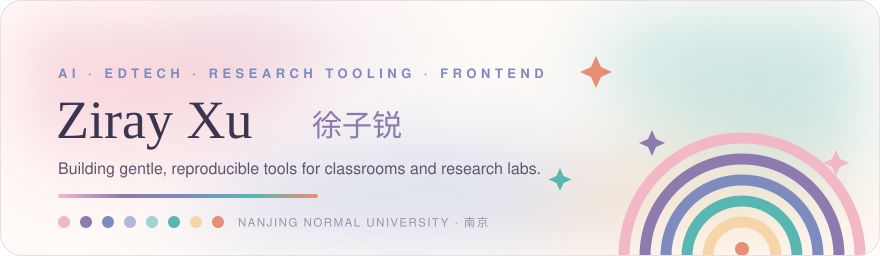
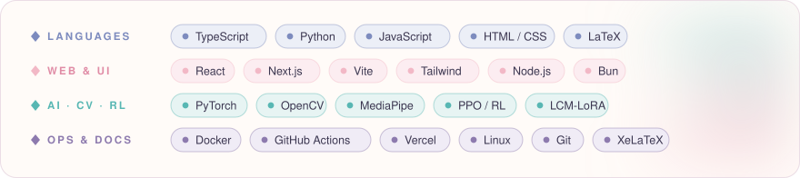
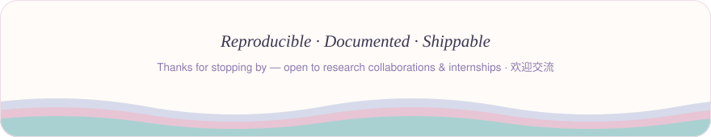

  

 

<table>
<tr>
<td width="50%" valign="top">🩺 <a href="https://github.com/handsomeZR-netizen/eldercare-monitor"><b>eldercare-monitor</b></a> Realtime safety dashboard for elderly-care institutions</td>
<td width="50%" valign="top">📑 <a href="https://github.com/handsomeZR-netizen/retraction-watch-mcp"><b>retraction-watch-mcp</b></a> Local-first academic-integrity screening over MCP</td>
</tr>
<tr>
<td width="50%" valign="top">🧰 <a href="https://github.com/handsomeZR-netizen/zhuoyu-workshop-skill"><b>zhuoyu-workshop-skill</b></a> Codex Skill for student project delivery</td>
<td width="50%" valign="top">⚡ <a href="https://github.com/handsomeZR-netizen/autodl-experiment-skill"><b>autodl-experiment-skill</b></a> Codex Skill for remote GPU experiment runs</td>
</tr>
</table>

 

<table>
<tr>
<td width="50%" valign="top">
<a href="https://github.com/handsomeZR-netizen/nnu-smartwrite"><b>nnu-smartwrite</b></a>&nbsp;
  
DeepSeek-powered English writing assessment — semantic scoring, CET-style evaluation, teacher feedback flows
</td>
<td width="50%" valign="top">
<a href="https://github.com/handsomeZR-netizen/zirui"><b>zirui</b></a> · <a href="https://github.com/handsomeZR-netizen/electrical-lab-core-algorithm"><b>electrical-lab-core-algorithm</b></a>&nbsp;
  
Multimodal electrical-lab tutor — drag-and-drop circuits, MNA solver, diagnostic feedback
</td>
</tr>
<tr>
<td width="50%" valign="top">
<a href="https://github.com/handsomeZR-netizen/jcip-latex-template"><b>jcip-latex-template</b></a> ⭐&nbsp;
  
Clean LaTeX template for <b>中文信息学报</b> with guided source &amp; academic defaults
</td>
<td width="50%" valign="top">
<a href="https://github.com/handsomeZR-netizen/plotweaver-skillkit"><b>plotweaver-skillkit</b></a>&nbsp;
  
Extract WeChat-article plotting styles, replay them in academic figures
</td>
</tr>
<tr>
<td width="50%" valign="top">
<a href="https://github.com/handsomeZR-netizen/webcam-fruit-ninja"><b>webcam-fruit-ninja</b></a> ⭐&nbsp;
  
Browser fruit-ninja with realtime webcam gesture recognition
</td>
<td width="50%" valign="top">
<a href="https://github.com/handsomeZR-netizen/nju-traffic-practicum-coursework"><b>nju-traffic-practicum-coursework</b></a>&nbsp;
  
Tencent Kaiwu traffic-light scheduling — DIY agents + PPO, reproducible runs, CI packaging
</td>
</tr>
<tr>
<td width="50%" valign="top">
<a href="https://github.com/handsomeZR-netizen/personal-markdown-online"><b>personal-markdown-online</b></a> ⭐&nbsp;
  
AI-assisted Markdown knowledge base — auth, DB, deploy
</td>
<td width="50%" valign="top">
<a href="https://github.com/handsomeZR-netizen/fastxebench"><b>fastxebench</b></a>&nbsp;
  
Reproducible XeLaTeX edit-to-PDF latency benchmark on Windows, with paper artifacts
</td>
</tr>
</table>

<b>More projects · 更多项目（9）</b>

 

- 🎓 [**dachuang-report**](https://github.com/handsomeZR-netizen/dachuang-report) — AI-assisted writing skill for engineering innovation reports &amp; defense materials
- 🎓 [**teacher-research-lab**](https://github.com/handsomeZR-netizen/teacher-research-lab) — teacher research-lab web prototype with cloud APIs &amp; animated UI
- 🎓 [**nnu-innovation-training-platform**](https://github.com/handsomeZR-netizen/nnu-innovation-training-platform) — innovation-training web platform with deployment automation
- 🔬 [**nnu-deeplearning-lcm-lora-benchmark**](https://github.com/handsomeZR-netizen/nnu-deeplearning-lcm-lora-benchmark) — LCM-LoRA image-generation benchmark with FID / LPIPS evaluation
- 🔬 [**mcm2026**](https://github.com/handsomeZR-netizen/mcm2026) — math-modeling workspace: analysis, drafting, visualization, reproducible notes
- 👋 [**gesture-lenet-showcase**](https://github.com/handsomeZR-netizen/gesture-lenet-showcase) — Python gesture computer-control with MediaPipe + OpenCV
- 🛍️ [**ecommerce-product-pages**](https://github.com/handsomeZR-netizen/ecommerce-product-pages) — high-perf React product page with Zustand &amp; Tailwind
- 📄 [**Localized-Resume-Editor**](https://github.com/handsomeZR-netizen/Localized-Resume-Editor) — privacy-first browser resume editor: no login, WYSIWYG, exports HTML
- ✅ [**koa-persistent-todo-api**](https://github.com/handsomeZR-netizen/koa-persistent-todo-api) — persistent Todo API: Koa, FS storage, Swagger, Docker, GitHub Actions

 

  

 

  

 

  

&nbsp;

  

