<!--
  本文件由 tools/build.py 生成：改 tools/profile.toml 后运行 python3 tools/build.py。
  Generated by tools/build.py from tools/profile.toml. Edit that file and re-run.
-->


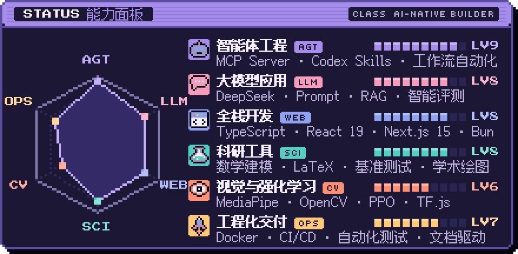

<a href="https://github.com/handsomeZR-netizen/mathmodel-skill"></a>
<a href="https://github.com/handsomeZR-netizen/ko5.6sol"></a>
<a href="https://github.com/handsomeZR-netizen/cn-patent-drafter"></a>
<a href="https://github.com/handsomeZR-netizen/zhuoyu-workshop-skill"></a>
<a href="https://github.com/handsomeZR-netizen/social-science-paperwork-skill"></a>
<a href="https://github.com/handsomeZR-netizen/retraction-watch-mcp"></a>

<a href="https://github.com/handsomeZR-netizen/eldercare-monitor">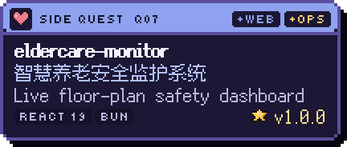</a>
<a href="https://github.com/handsomeZR-netizen/face-arcade">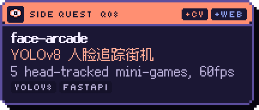</a>
<a href="https://github.com/handsomeZR-netizen/cannbot-bench-loop">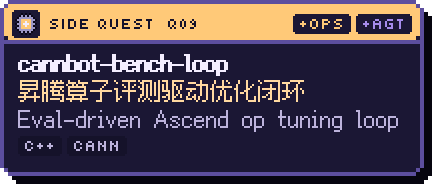</a>
<a href="https://github.com/handsomeZR-netizen/academic-topic-research-agent">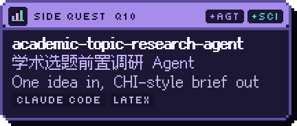</a>
<a href="https://github.com/handsomeZR-netizen/webcam-fruit-ninja">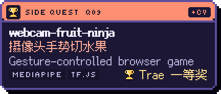</a>
<a href="https://github.com/handsomeZR-netizen/nnu-smartwrite">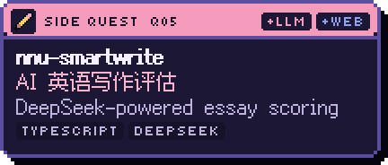</a>
<a href="https://github.com/handsomeZR-netizen/zirui">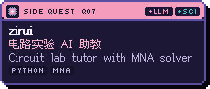</a>
<a href="https://github.com/handsomeZR-netizen/jcip-latex-template">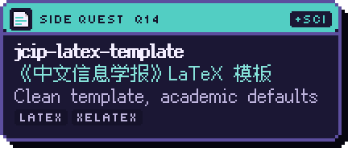</a>
<a href="https://github.com/handsomeZR-netizen/plotweaver-skillkit">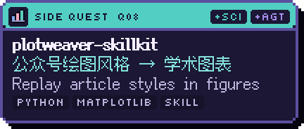</a>
<a href="https://github.com/handsomeZR-netizen/nju-traffic-practicum-coursework">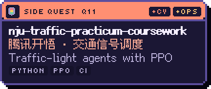</a>

<b>更多项目 · More projects (25)</b>

 

**AI Skill 与科研工具**

- [**niulai-paper-polish**](https://github.com/handsomeZR-netizen/niulai-paper-polish) — 牛来：顶会 / 顶刊终稿润色与证据守卫 Skill
- [**academic-paper-polish-v3**](https://github.com/handsomeZR-netizen/academic-paper-polish-v3) — 论文诊断、故事重构与润色 Skill — evidence-aligned revision for Codex
- [**llm-medical-evaluation-paper**](https://github.com/handsomeZR-netizen/llm-medical-evaluation-paper) — 把医学 LLM 对比变成可复核、可追溯的研究与论文
- [**autodl-experiment-skill**](https://github.com/handsomeZR-netizen/autodl-experiment-skill) — 远程 GPU 实验托管 Skill — AutoDL runs with email progress alerts
- [**nnu-gpu-connection-skill**](https://github.com/handsomeZR-netizen/nnu-gpu-connection-skill) — 南师大校园 GPU 连接 Skill — Claude Code & Codex CLI
- [**dachuang-report**](https://github.com/handsomeZR-netizen/dachuang-report) — 大创结题报告写作 Skill — innovation reports & defense materials
- [**claude-code-style-skill**](https://github.com/handsomeZR-netizen/claude-code-style-skill) — 让 Codex 说话像 Claude Code：简洁、如实、守工具纪律
- [**fastxebench**](https://github.com/handsomeZR-netizen/fastxebench) — XeLaTeX 编译延迟基准 — reproducible benchmark with paper artifacts
- [**mcm2026**](https://github.com/handsomeZR-netizen/mcm2026) — 数学建模工作区 — analysis, drafting, visualization
- [**nnu-deeplearning-lcm-lora-benchmark**](https://github.com/handsomeZR-netizen/nnu-deeplearning-lcm-lora-benchmark) — LCM-LoRA 图像生成基准 — FID / LPIPS evaluation

**工程、创意与课程项目**

- [**gpu-watcher**](https://github.com/handsomeZR-netizen/gpu-watcher) — SSH 盯远程 GPU，空出来立刻发邮件
- [**WeMP-Keeper**](https://github.com/handsomeZR-netizen/WeMP-Keeper) — 一条命令把公众号历史文章归档为 HTML + PDF + Excel
- [**smartshower-controller**](https://github.com/handsomeZR-netizen/smartshower-controller) — 校园热水 BLE/GATT 控制系统 — Python + Tkinter, audit logs
- [**lumen-light-lab**](https://github.com/handsomeZR-netizen/lumen-light-lab) — 光，也有触感 — zero-dependency WebGL2 light experiment
- [**personal-markdown-online**](https://github.com/handsomeZR-netizen/personal-markdown-online) — AI Markdown 知识库 — Next.js 15, DeepSeek tagging, Postgres
- [**probemate-web**](https://github.com/handsomeZR-netizen/probemate-web) — 课堂诊断门控原型 — ProbeMate Web v1.0.0
- [**birdclef-voice-recognition-system**](https://github.com/handsomeZR-netizen/birdclef-voice-recognition-system) — BirdCLEF 2026 鸟鸣识别 — MFCC, CNN/CRNN, Gradio demo
- [**nnu-nlp-gsm8k-coursework-2026**](https://github.com/handsomeZR-netizen/nnu-nlp-gsm8k-coursework-2026) — GSM8K 数学问答 — Seq2Seq, Transformer & LLMs
- [**electrical-lab-core-algorithm**](https://github.com/handsomeZR-netizen/electrical-lab-core-algorithm) — zirui 的电路核心算法库 — MNA solver & diagnostics
- [**teacher-research-lab**](https://github.com/handsomeZR-netizen/teacher-research-lab) — 教师科研实验室 Web 原型 — cloud APIs & animated UI
- [**nnu-innovation-training-platform**](https://github.com/handsomeZR-netizen/nnu-innovation-training-platform) — 创新训练项目平台 — deployment automation
- [**gesture-lenet-showcase**](https://github.com/handsomeZR-netizen/gesture-lenet-showcase) — 手势控制电脑 — MediaPipe + OpenCV
- [**ecommerce-product-pages**](https://github.com/handsomeZR-netizen/ecommerce-product-pages) — 高性能商品页 — React, Zustand & Tailwind
- [**Localized-Resume-Editor**](https://github.com/handsomeZR-netizen/Localized-Resume-Editor) — 隐私优先的本地简历编辑器 — no login, exports HTML
- [**koa-persistent-todo-api**](https://github.com/handsomeZR-netizen/koa-persistent-todo-api) — 持久化 Todo API — Koa, Swagger, Docker, GitHub Actions

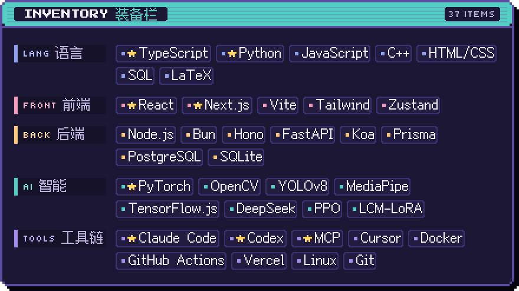

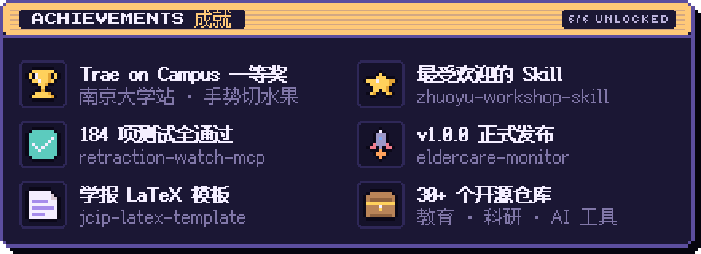


<a href="mailto:1516924835@qq.com">1516924835@qq.com</a> · 南京 Nanjing · 

