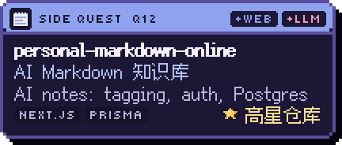

<!--
  本文件由 tools/build.py 生成：改 tools/profile.toml 后运行 python3 tools/build.py。
  Generated by tools/build.py from tools/profile.toml. Edit that file and re-run.
-->

<b>更多支线任务 · More side quests (11)</b>

 

- [**dachuang-report**](https://github.com/handsomeZR-netizen/dachuang-report) — 大创结题报告写作 Skill — AI-assisted writing for innovation reports & defense materials
- [**teacher-research-lab**](https://github.com/handsomeZR-netizen/teacher-research-lab) — 教师科研实验室 Web 原型 — cloud APIs & animated UI
- [**nnu-innovation-training-platform**](https://github.com/handsomeZR-netizen/nnu-innovation-training-platform) — 创新训练项目平台 — deployment automation & image optimization
- [**nnu-deeplearning-lcm-lora-benchmark**](https://github.com/handsomeZR-netizen/nnu-deeplearning-lcm-lora-benchmark) — LCM-LoRA 图像生成基准 — FID / LPIPS evaluation
- [**mcm2026**](https://github.com/handsomeZR-netizen/mcm2026) — 数学建模工作区 — analysis, drafting, visualization, reproducible notes
- [**fastxebench**](https://github.com/handsomeZR-netizen/fastxebench) — XeLaTeX 编译延迟基准 — reproducible edit-to-PDF latency benchmark with paper artifacts
- [**electrical-lab-core-algorithm**](https://github.com/handsomeZR-netizen/electrical-lab-core-algorithm) — zirui 的电路核心算法库 — MNA solver & diagnostics
- [**gesture-lenet-showcase**](https://github.com/handsomeZR-netizen/gesture-lenet-showcase) — 手势控制电脑 — MediaPipe + OpenCV
- [**ecommerce-product-pages**](https://github.com/handsomeZR-netizen/ecommerce-product-pages) — 高性能商品页 — React, Zustand & Tailwind
- [**Localized-Resume-Editor**](https://github.com/handsomeZR-netizen/Localized-Resume-Editor) — 隐私优先的本地简历编辑器 — no login, WYSIWYG, exports HTML
- [**koa-persistent-todo-api**](https://github.com/handsomeZR-netizen/koa-persistent-todo-api) — 持久化 Todo API — Koa, Swagger, Docker, GitHub Actions

<a href="mailto:1516924835@qq.com">1516924835@qq.com</a> · 南京 Nanjing · 

